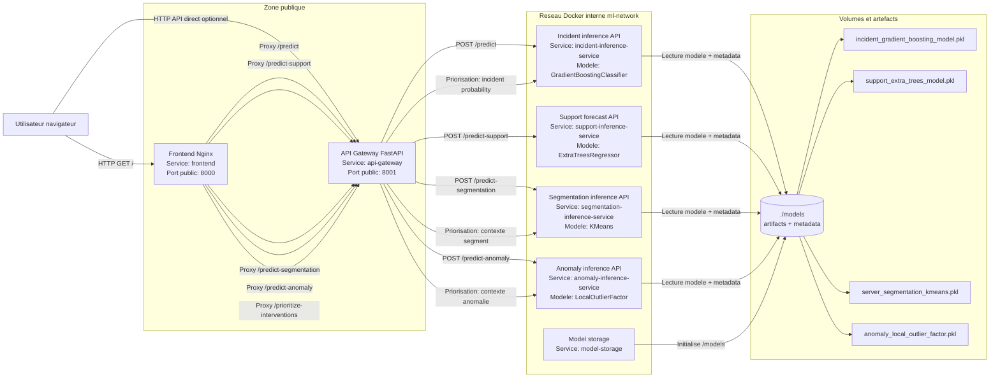

# Architecture de mise en production

Ce schema represente l'architecture Docker actuelle du projet. Le frontend est servi par Nginx, les appels API passent par un gateway FastAPI, puis chaque modele est expose par son propre microservice d'inference isole.

## Responsabilites des services

| Service | Role | Exposition |
| --- | --- | --- |
| `frontend` | Sert l'interface HTML et proxifie les routes API vers le gateway | Public, `localhost:8000` |
| `api-gateway` | Point d'entree API, routage et agregation des resultats | Public optionnel, `localhost:8001` |
| `incident-inference-service` | Prediction du risque incident et explication SHAP | Interne Docker |
| `support-inference-service` | Prevision des tickets support et explication SHAP | Interne Docker |
| `segmentation-inference-service` | Attribution d'un profil serveur | Interne Docker |
| `anomaly-inference-service` | Detection d'anomalie et explication locale | Interne Docker |
| `model-storage` | Conteneur de stockage/initialisation du repertoire `/models` | Interne Docker |

## Flux principaux

1. L'utilisateur ouvre `http://localhost:8000`.
2. Nginx sert le frontend statique.
3. Les formulaires du frontend appellent des routes relatives comme `/predict` ou `/predict-anomaly`.
4. Nginx proxifie ces appels vers `api-gateway:8000` dans le reseau Docker.
5. Le gateway appelle le microservice d'inference concerne.
6. Chaque microservice charge uniquement son artefact depuis le volume `./models:/models`.
7. Le resultat revient au frontend avec la prediction et son explication.

## Flux de priorisation

La route `/prioritize-interventions` est agregee par le gateway:

- appel du modele incident pour obtenir `incident_probability`;
- appel du modele anomalie pour obtenir le contexte d'anomalie;
- appel du modele segmentation pour obtenir le profil serveur;
- calcul metier final: `priority_score = incident_probability * business_value`.

Cette route ne repose pas sur un modele dedie supplementaire: elle reutilise les modeles existants et une regle metier explicable.
